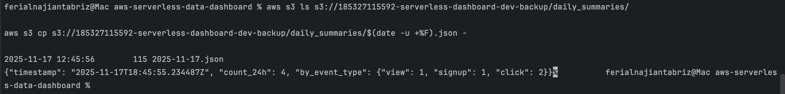

# AWS Serverless Data Dashboard (Cloud + Streamlit)

This project demonstrates a fully functional, production-style **AWS serverless pipeline** built using:

- **API Gateway** – Public ingestion endpoint  
- **Lambda (Python)** – Event processor & daily aggregator  
- **DynamoDB** – Event storage  
- **S3** – Daily summary backups  
- **EventBridge** – Scheduled aggregation  
- **CloudWatch** – Logs + alarms  
- **Streamlit** – Local analytics dashboard  

This system ingests events from any client, stores them in DynamoDB, generates daily rollups, and displays analytics.

---

## Architecture


---

## Features

### **Event Ingestion**
Send events via:
```

POST /event
{
"source": "web",
"event_type": "click",
"meta": { "user": "demo" }
}

````

### **Daily Aggregation**
A second Lambda runs every night:
- Reads the last 24 hours from DynamoDB  
- Groups by `event_type`  
- Saves a JSON summary to S3  

Sample output stored in S3:



---

## Local Analytics Dashboard (Streamlit)

Run the dashboard:

```bash
source .venv/bin/activate
export AWS_REGION=us-east-1
export TABLE_NAME=serverless-dashboard-dev-events
cd src/streamlit_app
streamlit run app.py
````

Dashboard example:


---

## 🛠️ Tech Stack

* AWS Lambda (Python)
* DynamoDB (NoSQL)
* API Gateway HTTP API
* EventBridge (cron scheduling)
* S3 (data lake)
* CloudFormation (IaC)
* Streamlit (analytics UI)
* boto3 (AWS SDK)

---

## 📦 Deployment

Deploy the entire system:

```bash
./scripts/deploy.sh us-east-1
```

Remove it:

```bash
./scripts/teardown.sh us-east-1
```

---

## Why This Project Matters

This project showcases:

* Cloud-native architecture
* Infrastructure-as-code (CloudFormation)
* AWS services integration
* Serverless compute (Lambda)
* Data ingestion + analytics
* Observability (CloudWatch)
* Real dashboard visualization


````

---


# Add → Commit → Push to GitHub

From project root:

```bash
git add .
git commit -m "Add dashboard screenshot + README update"
git push