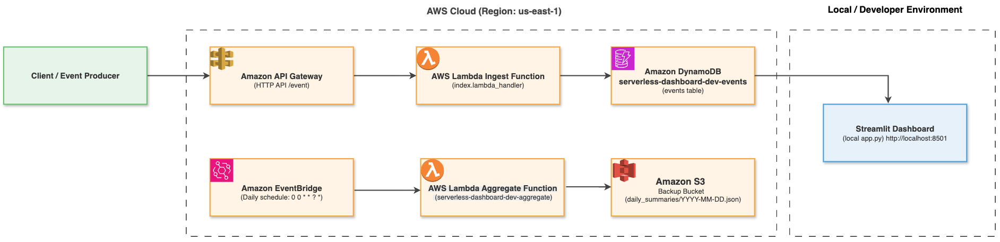
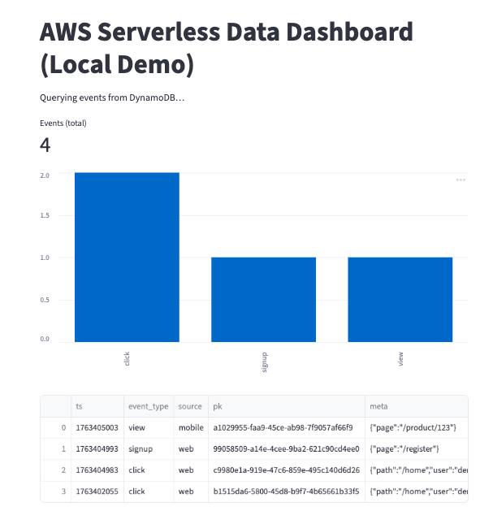

# AWS Cloud Cost-Optimized Serverless Data Dashboard

## Overview
A fully serverless AWS project demonstrating real-world cloud architecture using Free Tier services.

##️ Architecture
- **API Gateway** → **Lambda** → **DynamoDB**
- **S3** for static backups and logs
- **CloudWatch** for monitoring
- **QuickSight** (or Streamlit) for data visualization

## ️ AWS Services Used
Lambda, S3, DynamoDB, API Gateway, IAM, CloudWatch, CloudFormation, QuickSight

##  Deployment
1. Clone repo  
2. Update `config.yaml` with your AWS credentials  
3. Run `aws cloudformation deploy --template-file template.yaml --stack-name serverless-dashboard`

##  Dashboard
Example metrics:
- Daily request count
- Average response latency
- Error rates over time

##  Security & Cost Optimization
- IAM least privilege  
- CloudWatch alarms  
- All within AWS Free Tier

##  Learning Outcomes
- Understand core AWS services and their integration  
- Practice Infrastructure as Code  
- Experience with monitoring and alerting

##  Future Enhancements
- Add user authentication (Cognito)
- Add SNS alerting
- Add front-end web portal

